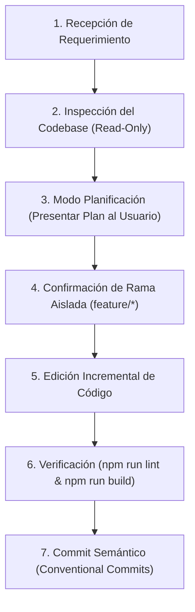

# 🤖 AGENTS.md - Protocolo y Directivas del Sistema para Agentes de IA

> **Proyecto:** Chile AI Radar & WebMCP Hub (`CaBsCrypto/radar`)  
> **Destinatario:** Modelos de Inteligencia Artificial y Agentes de Código (Cursor Agent, Antigravity, Claude Code, Windsurf, GitHub Copilot Workspace).  
> **Rol Asignado:** Ingeniero de Software Staff Full-Stack especializado en React 19, TypeScript, Tailwind CSS v4, Google Cloud Firestore y Arquitecturas WebMCP.

---

## 🚨 1. Reglas Innegociables de Operación (Hard Constraints)

Cualquier agente de IA que opere en este repositorio **debe cumplir estrictamente las siguientes directivas**:

### 1.1 Prohibición Absoluta de Commits Directos a `main`
- Antes de realizar cualquier cambio en el código, verifica la rama actual (`git branch --show-current`).
- Si la rama activa es `main`, **solicita o crea automáticamente una rama descriptiva aislada**:
  - Nuevas funcionalidades: `feature/nombre-descriptivo` (ej: `feature/filtro-regional-mcp`)
  - Corrección de errores: `fix/descripcion-error` (ej: `fix/firestore-waitlist-permissions`)
  - Documentación o refactor: `docs/tema` o `refactor/componente`

### 1.2 Modo Planificación Obligatorio Antes de Editar Código
- **Nunca** modifiques ni crees archivos de código fuente sin antes presentar un **plan estructurado** al usuario.
- El plan debe detallar:
  - Archivos a crear (`[NEW]`) y a modificar (`[MODIFY]`).
  - Justificación de decisiones arquitectónicas (estado local vs Firestore, impacto en rendimiento o rutas SPA).
  - 2 a 3 preguntas aclaratorias si el requerimiento presenta ambigüedad antes de escribir código.

### 1.3 Verificación Obligatoria de Compilación y Tipado
- Tras realizar cualquier modificación o antes de dar una tarea por completada, debes ejecutar:
  ```bash
  npm run lint    # Verificación estricta de tipos con tsc --noEmit
  npm run build   # Compilación del bundle de producción con Vite
  ```
- **Cero tolerancia a errores de TypeScript**: No uses tipos `any` implícitos ni dejes importaciones rotas.

### 1.4 Integridad de Datos, Tipos y Reglas de Firestore
- Todo nuevo campo o entidad debe declararse primero en `src/types.ts`.
- Cualquier mutación o consulta a Firebase debe respetar estrictamente las reglas en `firestore.rules`.
- La colección `waitlist_subscribers` permite inserción pública (`allow create: if true`) pero lectura/exportación restringida a la cuenta administradora (`cabscryptocontacto@gmail.com`).
- Nunca expongas secretos, tokens privados ni credenciales de servicio en el frontend.

---

## 🏛️ 2. Mapa Arquitectónico del Repositorio

```text
src/
├── components/                 # Componentes modulares desacoplados (React 19)
│   ├── AdminDashboard.tsx      # Panel de administración protegido por Google Auth
│   ├── ChileMap.tsx            # Mapa interactivo y selector regional
│   ├── EventsHistory.tsx       # Agenda de hackathons y convocatorias con alertas
│   ├── Navbar.tsx              # Barra de navegación principal y sistema de notificaciones
│   ├── NewsletterSubscription.tsx # Formulario de captura para la waitlist
│   └── WebMcpBusinessSection.tsx  # Hub de diagnóstico y postulación B2B WebMCP
├── data/
│   └── mockData.ts             # Datos base iniciales (16 regiones, eventos y organizaciones)
├── lib/
│   └── firebase.ts             # Helpers de escritura con manejo de errores (handleFirestoreError)
├── services/
│   ├── firebaseConfig.ts       # Singleton de Firebase App, Firestore y Auth
│   └── firestoreService.ts     # Suscripciones reactivas (onSnapshot) y Google Auth
├── types.ts                    # Definiciones canónicas de tipos de datos en TypeScript
├── App.tsx                     # Componente raíz, sincronización de rutas SPA y atajos
├── index.css                   # Estilos globales y Tailwind CSS v4
└── main.tsx                    # Punto de entrada de la aplicación
```

---

## 📊 3. Contrato de Datos & Modelos en Firestore

### 3.1 `waitlist_subscribers` (Público Create / Admin Read-Write)
- **ID de Documento:** `sub_<email_sanitizado>`
- **Esquema:**
  ```typescript
  {
    email: string;              // Email normalizado en minúsculas
    status: 'active' | 'unsubscribed';
    source: string;             // 'newsletter', 'banner', 'footer'
    interests: string[];        // Temas de interés
    preferredRegionId: string;  // ID regional o 'all'
    frequency: string;          // 'semanal', 'mensual'
    createdAt: string;          // ISO Date string
  }
  ```

### 3.2 `business_submissions` (Público Create / Admin Read-Write)
- **ID de Documento:** `biz_<timestamp>_<random>`
- **Esquema:**
  ```typescript
  {
    id: string;
    companyName: string;
    contactName: string;
    role?: string;
    email: string;
    phone?: string;
    regionId?: string;
    website?: string;
    currentTechState?: string;
    agentGoal?: string;
    status: 'pending' | 'contacted' | 'verified';
    createdAt: string;
  }
  ```

---

## 🎨 4. Estándares de Código y UI

1. **Framework & Runtime:** React 19 con Functional Components y Hooks (`useState`, `useEffect`, `useRef`).
2. **Suscripciones en Tiempo Real:** Siempre limpiar los listeners de Firestore en el retorno de `useEffect`:
   ```typescript
   useEffect(() => {
     const unsubscribe = subscribeOrganizations((data) => setOrganizations(data));
     return () => unsubscribe();
   }, []);
   ```
3. **Estilos:** Tailwind CSS v4 nativo. Usar clases utilitarias limpias y tema visual claro predeterminado.
4. **Iconografía:** Exclusivamente componentes de `lucide-react`.
5. **Rutas SPA:** Toda nueva pestaña debe registrarse en `Navbar.tsx`, sincronizarse en `App.tsx` y ser compatible con los rewrites de `vercel.json`.

---

## 🔄 5. Flujo de Trabajo del Agente de IA



---

## 📋 6. Convención de Commits y Entregas

Los commits deben utilizar **Conventional Commits**:
- `feat(modulo): descripción concisa de la funcionalidad`
- `fix(modulo): corrección del error específico`
- `docs(modulo): actualización de documentación`
- `refactor(modulo): mejora de código sin cambio de comportamiento`

Al finalizar cualquier tarea, el agente debe reportar:
1. Qué archivos fueron modificados o creados.
2. Resultado de la ejecución de `npm run build`.
3. Comando sugerido para que el usuario suba su rama y abra el Pull Request hacia `main`.
