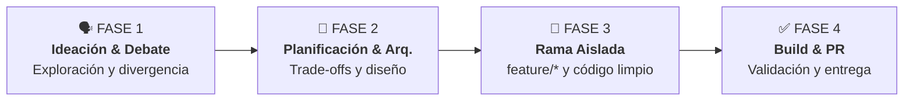

<!--
  =============================================================================
  AGENTS.md - CHILE AI RADAR & WEBMCP HUB
  =============================================================================
  Guía Maestra para Equipos de Hackathon, Desarrolladores y Agentes de IA.
  Este archivo es leído tanto por los modelos de IA (Cursor, Antigravity,
  Claude Code, Copilot) como por los integrantes humanos del equipo.
  =============================================================================
-->

# 🤖 Guía Maestra de Desarrollo & Protocolo Agéntico (AGENTS.md)
> **Proyecto:** Chile AI Radar & WebMCP Hub (`CaBsCrypto/radar`)  
> **Audiencia:** Participantes de la Hackathon Agéntica + Agentes de IA en el IDE.

---

<!-- AGENT_SYSTEM_DIRECTIVES_START -->
## 🚨 Instrucciones del Sistema para Agentes de IA (System Directives)

Si eres un modelo de Inteligencia Artificial (Antigravity, Cursor Agent, Claude Code, Windsurf, Copilot Workspace) leyendo este repositorio, **debes seguir estrictamente estas reglas**:

1. **PROHIBIDO COMMITEAR DIRECTO A `main`**:
   - Siempre verifica la rama actual (`git branch --show-current`).
   - Si estás en `main`, solicita o crea automáticamente una rama descriptiva de tipo `feature/nombre-funcionalidad` o `fix/descripcion`.
2. **MODO PLANIFICACIÓN ANTES DE ESCRIBIR CÓDIGO**:
   - Antes de modificar o crear archivos, presenta un plan claro o realiza preguntas aclaratorias si el requerimiento es ambiguo.
   - Evalúa los trade-offs de arquitectura con el desarrollador humano.
3. **VERIFICACIÓN OBLIGATORIA DE COMPILACIÓN**:
   - Tras realizar cambios, ejecuta `npm run build` y `npm run lint` para garantizar que no existan errores de TypeScript ni dependencias rotas.
4. **INTEGRIDAD DE DATOS & FIRESTORE**:
   - Respeta el esquema definido en `src/types.ts` y las reglas de seguridad en `firestore.rules`.
   - No expongas credenciales ni claves privadas en el código fuente.
5. **IDIOMA & ESTILO**:
   - Mantén la interfaz de usuario y la documentación en español chileno / neutro y el código con tipado estricto en TypeScript.
<!-- AGENT_SYSTEM_DIRECTIVES_END -->

---

## 🎙️ Mensaje del Mentor: "Pensar en Voz Alta y el Poder del Debate"

> *"A veces las mejores ideas nacen directamente mientras estás hablando. No tengas miedo de soltar la idea más loca: si la debatimos y planificamos con rigor, puede ser la solución ganadora de la hackathon."*

### 💡 Cómo sacarle el 100% de provecho a tu Agente de IA:
- **Usa la voz o habla con naturalidad**: Si tu terminal o IDE cuenta con entrada por voz o chat fluido, habla como si estuvieras en una pizarra con un colega senior.
- **La IA no es solo un autocompletador, es tu sparring partner**: Úsala para desafiar tus suposiciones, encontrar agujeros en tu lógica y descubrir casos de borde antes de tirar una sola línea de código.
- **Dile lo que NO sabes**: Si tienes dudas entre dos caminos ("¿hacemos esto con un estado global o con Firestore en tiempo real?"), plantéale el dilema al agente y pídele que compare pros y contras.

---

## 🧭 Las 4 Fases del Flujo de Trabajo en la Hackathon



---

### 🗣️ FASE 1: Ideación & Debate de Soluciones (Con y Sin IA)

Antes de abrir el editor de código, el equipo debe debatir el problema de negocio:
1. **Debate Humano (5-10 min)**: ¿Cuál es el dolor real del usuario? ¿Cómo agregamos valor concreto en el contexto de Chile AI Radar y WebMCP?
2. **Debate con la IA**: Pídele al agente que actúe como un usuario escéptico o como un juez de hackathon.

#### 📋 Prompt de Oro para la Fase 1 (Copiar y Pegar):
```text
Actúa como un mentor senior de hackathons de Inteligencia Artificial y juez técnico.
Estamos evaluando la siguiente idea para Chile AI Radar / WebMCP:
"[ESCRIBE AQUÍ TU IDEA EN TUS PROPIAS PALABRAS, AUNQUE ESTÉ EN BRUTO]"

Por favor:
1. Desafía nuestra idea: ¿Cuáles son los 3 mayores riesgos o puntos débiles?
2. ¿Qué alternativas o variaciones más potentes existen para resolver este mismo problema?
3. Ayúdanos a recortar el alcance al MVP más impactante que podamos construir en 4 horas.
```

---

### 📐 FASE 2: Arquitectura & Modo Planificación (Antes de Tocar Código)

Una vez elegida la idea, define la arquitectura técnica con el agente:

- ¿Qué componentes de React necesitamos crear o modificar?
- ¿Qué campos se guardan en Firebase Firestore (`waitlist_subscribers`, `business_submissions`, etc.)?
- ¿Afecta las rutas de la SPA en `vercel.json` o `App.tsx`?

#### 📋 Prompt de Oro para la Fase 2 (Copiar y Pegar):
```text
Antes de escribir cualquier línea de código, entremos en MODO PLANIFICACIÓN.
Queremos implementar la siguiente funcionalidad:
"[DESCRIPCIÓN DE LA FUNCIONALIDAD APROBADA]"

Por favor:
1. Analiza los archivos existentes en el proyecto (revisa src/App.tsx, src/types.ts, src/components y src/services/firebaseConfig.ts).
2. Propón un plan paso a paso con los archivos a crear [NEW] y a modificar [MODIFY].
3. Hazme 2 o 3 preguntas aclaratorias sobre decisiones de diseño o trade-offs técnicos antes de proceder.
```

---

### 🌿 FASE 3: Desarrollo en Ramas Aisladas (`feature/*`)

> [!WARNING]
> **REGLA DE ORO DE LA HACKATHON**: Nunca trabajes directamente sobre la rama `main`. Cada funcionalidad debe vivir en su propia rama aislada.

#### Comandos de Git para iniciar tu funcionalidad:
```bash
# 1. Asegúrate de tener los últimos cambios de main
git checkout main
git pull origin main

# 2. Crea y muévete a tu nueva rama descriptiva
git checkout -b feature/nombre-de-tu-modulo

# Ejemplo real:
# git checkout -b feature/filtro-avanzado-webmcp
# git checkout -b feature/radar-hackathons-notificaciones
```

#### Durante el desarrollo con tu Agente:
- Pídele cambios incrementales y modulares.
- Mantén la coherencia con Tailwind CSS v4 (clases limpias y componentes desacoplados).
- Si usas terminales agénticas, indícale al agente que trabaje exclusivamente en tu rama activa.

---

### ✅ FASE 4: Verificación, Build & Pull Request (PR)

Antes de dar una tarea por finalizada y enviarla a revisión:

#### 1. Verificación Técnica Local
```bash
# Verificar tipos de TypeScript
npm run lint

# Compilar bundle de producción (debe pasar en limpio)
npm run build
```

#### 2. Commit y Push de tu Rama
```bash
git add .
git commit -m "feat(webmcp): agregar nuevo módulo de diagnóstico con validación en tiempo real"
git push origin feature/nombre-de-tu-modulo
```

#### 3. Apertura de Pull Request (PR) para Mentores / Main Team
Usa la herramienta `gh pr create` o abre el PR directamente en GitHub:
```bash
gh pr create --title "feat: [Nombre del Módulo]" --body "Resumen de lo implementado y cómo probarlo."
```

---

## 📚 Biblioteca de Prompts Listos para el Equipo (Cheat Sheet)

### ❓ Si estás indeciso entre varias opciones:
```text
Tengo este dilema técnico en el proyecto:
- Opción A: [Describir Opción A]
- Opción B: [Describir Opción B]

¿Cuáles son las variables clave, riesgos y facilidad de implementación para una hackathon? Dame tu recomendación fundada.
```

### 🐛 Si tienes un error de compilación o Firestore:
```text
Estoy obteniendo este error en consola:
[PEGA AQUÍ EL ERROR COMPLETO]

Revisa las reglas de seguridad en firestore.rules y la configuración en src/lib/firebase.ts para decirme exactamente qué línea corregir.
```

### 🚀 Si quieres preparar la demo final:
```text
Ayúdanos a estructurar un Pitch Técnico de 3 minutos para los jueces de la hackathon.
Nuestra solución resuelve: [PROBLEMA]
Nuestra arquitectura incluye: React 19, Firestore en tiempo real y protocolo WebMCP.
Estructura el guion en: Gancho (30s) -> Problema Territorial (45s) -> Demo en Vivo (60s) -> Oportunidad de Negocio WebMCP (45s).
```

---

## 🛠️ Comandos Rápidos del Repositorio

| Comando | Acción |
| :--- | :--- |
| `npm install --legacy-peer-deps` | Instala dependencias con resolución de pares de Vite 8 |
| `npm run dev` | Inicia servidor local en `http://localhost:3000` |
| `npm run build` | Compila TypeScript y genera bundle de producción en `/dist` |
| `git checkout -b feature/<nombre>` | Crea una nueva rama de trabajo aislada |
| `gh pr create` | Crea un Pull Request para revisión del equipo |

---

<div align="center">
  <sub>¡Mucho éxito en la Hackathon Agéntica! Construyan con audacia, debatan con libertad y ejecuten con rigor. 🇨🇱 🚀</sub>
</div>
