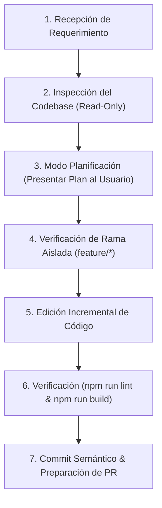

# 🤖 AGENTS.md - Protocolo y Directivas del Sistema para Agentes de IA

> **Proyecto:** Chile AI Radar & WebMCP Hub (`CaBsCrypto/radar`)  
> **Destinatario:** Modelos de Inteligencia Artificial y Agentes de Código (Cursor Agent, Antigravity, Claude Code, Windsurf, GitHub Copilot Workspace).  
> **Propósito:** Directivas obligatorias de comportamiento, arquitectura, git workflow y estándares de calidad para este repositorio.

---

## 🚨 Reglas Innegociables de Operación (Hard Constraints)

Cualquier agente de IA que opere en este repositorio **debe cumplir estrictamente las siguientes reglas**:

### 1. PROHIBICIÓN ABSOLUTA DE COMMITS DIRECTOS A `main`
- Antes de realizar cualquier cambio en el código, verifica la rama actual (`git branch --show-current`).
- Si la rama activa es `main`, **solicita o crea automáticamente una rama descriptiva aislada**:
  - Nuevas funcionalidades: `feature/nombre-descriptivo` (ej: `feature/filtro-regional-mcp`)
  - Corrección de bugs: `fix/descripcion-error` (ej: `fix/firestore-waitlist-permissions`)
  - Documentación o refactor: `docs/tema` o `refactor/componente`

### 2. MODO PLANIFICACIÓN OBLIGATORIO ANTES DE EDITAR CÓDIGO
- No modifiques ni crees archivos de código fuente sin antes presentar un **plan estructurado** al usuario.
- El plan debe detallar:
  - Archivos a crear (`[NEW]`) y a modificar (`[MODIFY]`).
  - Justificación de trade-offs arquitectónicos (estado local vs Firestore, impacto en rendimiento o rutas).
  - 2 a 3 preguntas aclaratorias si el requerimiento presenta ambigüedad.

### 3. VERIFICACIÓN OBLIGATORIA DE COMPILACIÓN Y TIPADO
- Tras realizar cualquier modificación o antes de dar una tarea por completada, debes ejecutar:
  ```bash
  npm run lint    # Verificación de tipos con tsc --noEmit
  npm run build   # Compilación del bundle de producción con Vite
  ```
- **Cero tolerancia a errores de TypeScript**: No dejes tipos `any` implícitos ni importaciones rotas.

### 4. INTEGRIDAD DE DATOS, TIPOS Y REGLAS DE FIRESTORE
- Todo nuevo campo o entidad debe declararse primero en `src/types.ts`.
- Cualquier cambio en la interacción con Firebase debe respetar las reglas de seguridad en `firestore.rules`.
- La colección `waitlist_subscribers` permite inserción pública (`allow create: if true`) pero lectura/exportación restringida a la cuenta de administración.
- Nunca expongas secretos, tokens o credenciales en el frontend.

---

## 🏛️ Arquitectura del Repositorio

### Estructura de Capas
```text
src/
├── components/          # Componentes modulares desacoplados (React 19)
├── data/mockData.ts     # Datos base del ecosistema (regiones, organizaciones iniciales)
├── lib/firebase.ts      # Funciones de mutación y consulta a Firestore
├── services/
│   ├── firebaseConfig.ts   # Instancia singleton de Firebase App, Firestore y Auth
│   └── firestoreService.ts # Subscripciones reactivas (onSnapshot) y Google Auth
├── types.ts             # Definiciones canónicas de tipos de datos en TypeScript
├── App.tsx              # Componente raíz y sincronización de rutas SPA
└── index.css            # Estilos globales y Tailwind CSS v4
```

### Principios de UI & Estilo
- **Framework de Estilos**: Tailwind CSS v4. Usa clases utilitarias limpias y evita CSS inline personalizado.
- **Tema Visual**: Modo claro predeterminado y consistente en toda la plataforma.
- **Iconografía**: Exclusivamente `lucide-react`.
- **Enrutamiento SPA**: Manejado en `App.tsx` sincronizado con `vercel.json` para rutas como `/`, `/eventos`, `/webmcp` y `/admin`.

---

## 🔄 Flujo de Trabajo Esperado para el Agente



---

## 📋 Convención de Commits y Pull Requests

Los commits deben seguir la convención de **Conventional Commits**:
- `feat(modulo): descripción concisa de la funcionalidad`
- `fix(modulo): corrección del error específico`
- `docs(modulo): actualización de documentación`
- `refactor(modulo): mejora de código sin cambio de comportamiento`

Al finalizar una funcionalidad, resume los cambios indicando:
1. Qué archivos fueron modificados o creados.
2. Qué pruebas locales de compilación fueron ejecutadas (`npm run build` exitoso).
3. Comando sugerido para que el usuario abra el Pull Request hacia `main`.
