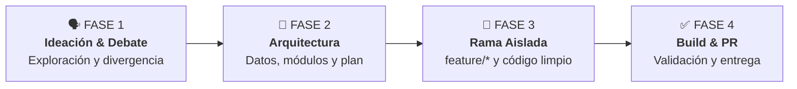
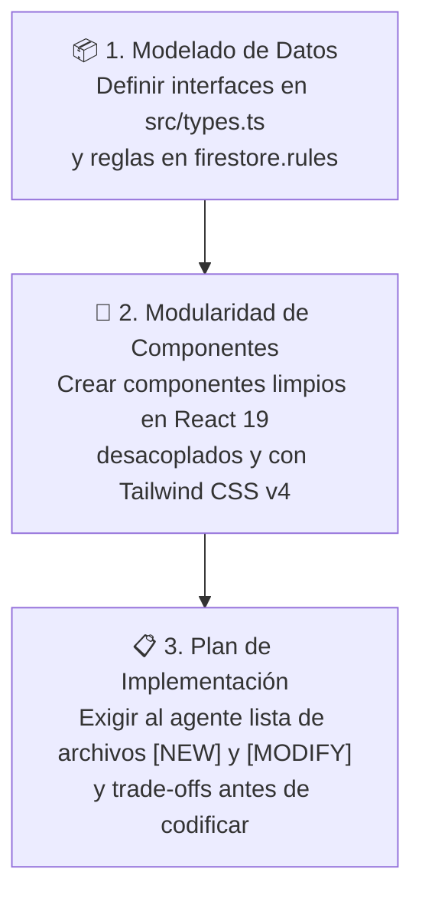

# 🎓 Guía de Desarrollo para Estudiantes & Equipos (ESTUDIANTES.md)
> **Proyecto:** Chile AI Radar & WebMCP Hub (`CaBsCrypto/radar`)  
> **Audiencia:** Desarrolladores, estudiantes y participantes de hackathons que colaboran con Agentes de Inteligencia Artificial.

---

## 🎙️ Filosofía de Trabajo: "Pensar en Voz Alta y el Poder del Debate"

> *"A veces las mejores ideas nacen directamente mientras estás hablando. No tengas miedo de soltar la idea más loca: si la debatimos y la estructuramos con estrategia, puede ser la solución ganadora."*

### 💡 Cómo sacarle el 100% de provecho a tu Agente de IA:
1. **Habla o escribe con naturalidad**: Si tu terminal o IDE cuenta con entrada por voz o chat fluido, habla como si estuvieras en una pizarra con un compañero senior de equipo.
2. **La IA no es un autocompletador, es tu sparring partner**: Pídele que cuestione tus ideas, que busque agujeros en tu lógica y que te proponga casos de borde antes de tirar una sola línea de código.
3. **Plantea tus dudas sin vergüenza**: Si estás dudando entre dos soluciones ("¿hacemos esto con un estado en React o con Firestore en tiempo real?"), plantéale el dilema al agente y pídele que compare pros y contras técnicos.

---

## 🧭 Las 4 Fases del Ciclo de Desarrollo



---

### 🗣️ FASE 1: Ideación & Debate de Soluciones (Con y Sin IA)

Antes de abrir el editor de código, el equipo debe entender y aterrizar el problema de negocio:

1. **Debate Humano (5-10 min)**:
   - ¿Cuál es el dolor real del usuario?
   - ¿Cómo aportamos valor en el contexto de Chile AI Radar y WebMCP?
2. **Debate con la IA**:
   - Pídele al agente que actúe como un juez técnico exigente para validar la solidez de la idea.

#### 📋 Prompt Listo para Copiar (Fase 1):
```text
Actúa como un arquitecto senior de software y juez técnico.
Estamos evaluando la siguiente idea para Chile AI Radar / WebMCP:
"[ESCRIBE AQUÍ TU IDEA EN TUS PROPIAS PALABRAS, AUNQUE ESTÉ EN BRUTO]"

1. Desafía nuestra idea: ¿Cuáles son los 3 mayores riesgos o puntos débiles?
2. ¿Qué alternativas o variaciones más potentes existen para resolver este mismo problema?
3. Ayúdanos a recortar el alcance al MVP más impactante que podamos construir en pocas horas.
```

---

### 📐 FASE 2: Arquitectura & Modo Planificación (Antes de Tocar Código)

Una vez elegida la idea, no dejes que el agente escriba código inmediatamente. Estructura la arquitectura en **3 pilares clave**:



1. **Pilar 1 - Modelado de Datos**: ¿Qué campos necesitamos guardar? ¿Cómo se llaman los tipos en `src/types.ts`? ¿Requiere permisos en Firestore (`firestore.rules`)?
2. **Pilar 2 - Modularidad de Componentes**: ¿Qué componente nuevo crearemos en `src/components/`? ¿Cómo se comunica con `App.tsx`?
3. **Pilar 3 - Plan de Implementación**: El agente debe presentarte una lista detallada de archivos a crear (`[NEW]`) y modificar (`[MODIFY]`) antes de tocar el proyecto.

#### 📋 Prompt Listo para Copiar (Fase 2):
```text
Antes de escribir cualquier línea de código, entremos en MODO PLANIFICACIÓN.
Queremos implementar la siguiente funcionalidad:
"[DESCRIPCIÓN DE LA FUNCIONALIDAD APROBADA]"

1. Analiza los archivos existentes en el proyecto (revisa src/App.tsx, src/types.ts, src/components y src/services/firebaseConfig.ts).
2. Propón un plan paso a paso con los archivos a crear [NEW] y a modificar [MODIFY].
3. Hazme 2 o 3 preguntas aclaratorias sobre decisiones de diseño o trade-offs técnicos antes de proceder.
```

---

### 🌿 FASE 3: Desarrollo en Ramas Aisladas (`feature/*`)

> [!WARNING]
> **REGLA DE ORO DE INGENIERÍA**: Nunca trabajes directamente sobre la rama `main`. Cada funcionalidad debe vivir en su propia rama aislada.

#### Comandos de Git para iniciar tu funcionalidad:
```bash
# 1. Asegúrate de tener los últimos cambios de main
git checkout main
git pull origin main

# 2. Crea y muévete a tu nueva rama descriptiva
git checkout -b feature/nombre-de-tu-modulo

# Ejemplos reales:
# git checkout -b feature/filtro-avanzado-webmcp
# git checkout -b feature/radar-hackathons-notificaciones
```

#### Buenas Prácticas durante el desarrollo:
- Pídele al agente cambios **incrementales y modulares** (un archivo a la vez).
- Mantén el código limpio con Tailwind CSS v4.
- Si el agente se equivoca, no borres todo: dile el error exacto de consola para que lo corrija de forma quirúrgica.

---

### ✅ FASE 4: Verificación, Compilación & Pull Request (PR)

Antes de dar una tarea por finalizada y enviarla a revisión:

#### 1. Verificación Técnica Local Obligatoria
```bash
# Verificar que no existan errores de TypeScript
npm run lint

# Compilar bundle de producción con Vite (debe pasar en limpio sin errores)
npm run build
```

#### 2. Guardar y Subir tus Cambios
```bash
git add .
git commit -m "feat(modulo): resumen conciso de lo implementado"
git push origin feature/nombre-de-tu-modulo
```

#### 3. Apertura de Pull Request (PR)
Abre el Pull Request en GitHub o mediante la terminal con `gh`:
```bash
gh pr create --title "feat: [Nombre del Módulo]" --body "Resumen de lo implementado y cómo probarlo."
```

---

## 📚 Biblioteca de Prompts de Ayuda Rápida

### ❓ Si estás indeciso entre dos caminos técnicos:
```text
Tengo este dilema técnico en el proyecto:
- Opción A: [Describir Opción A]
- Opción B: [Describir Opción B]

Compara las variables clave, riesgos y facilidad de implementación. Dame tu recomendación fundada.
```

### 🐛 Si tienes un error en consola o Firestore:
```text
Estoy obteniendo este error en consola:
[PEGA AQUÍ EL ERROR COMPLETO]

Revisa las reglas de seguridad en firestore.rules y la configuración en src/lib/firebase.ts para decirme exactamente qué línea corregir.
```

---

## 🛠️ Comandos Rápidos del Proyecto

| Comando | Acción |
| :--- | :--- |
| `npm install --legacy-peer-deps` | Instala dependencias del proyecto con resolución de pares |
| `npm run dev` | Inicia el servidor de desarrollo local en `http://localhost:3000` |
| `npm run build` | Compila TypeScript y genera el bundle de producción en `/dist` |
| `git checkout -b feature/<nombre>` | Crea una nueva rama de trabajo aislada |
| `gh pr create` | Crea un Pull Request para revisión del equipo |

---

<div align="center">
  <sub>Construyan con audacia, debatan con libertad y ejecuten con foco. 🇨🇱 🚀</sub>
</div>
