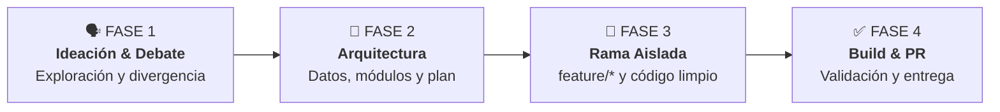
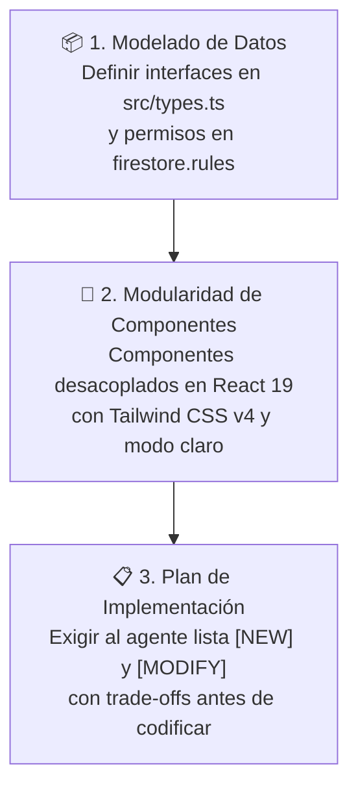

# 🎓 Guía Maestra de Desarrollo para Estudiantes & Equipos (ESTUDIANTES.md)
> **Proyecto:** Chile AI Radar & WebMCP Hub (`CaBsCrypto/radar`)  
> **Audiencia:** Desarrolladores, estudiantes y participantes de hackathons que colaboran con Agentes de Inteligencia Artificial.

---

## 🎙️ 1. Filosofía de Trabajo: "Pensar en Voz Alta y el Poder del Debate"

> *"A veces las mejores ideas nacen directamente mientras estás hablando. No tengas miedo de soltar la idea más loca: si la debatimos y la estructuramos con estrategia, puede ser la solución ganadora."*

### 💡 Principios de Colaboración Humano-IA:
1. **La IA es tu Sparring Partner, no tu reemplazo**: Tu rol es el de **Director Técnico y de Producto**; el agente es un desarrollador senior ejecutor. Exígele justificaciones técnicas y no aceptes código a ciegas.
2. **Habla y debate con libertad**: Si tu entorno o IDE tiene entrada de voz o chat interactivo, expresa tus ideas en bruto. Deja que la IA te ayude a ordenar el caos inicial y convertirlo en requerimientos claros.
3. **Descompón problemas grandes en micro-pasos**: En lugar de pedir *"construye todo el sistema de reportes"*, avanza en hitos: (1) definir datos en `src/types.ts`, (2) crear servicio de consulta, (3) diseñar componente UI, (4) conectar en `App.tsx`.

---

## ⚡ 2. Guía de Velocidad: Hábitos que te Aceleran vs Hábitos que te Frenan

| 🛑 Hábito que te Frena | 🚀 Hábito que te Acelera |
| :--- | :--- |
| **Mega-Prompts abstractos** *(ej: "Hazme todo el sistema de empresas")*<br>Produce código desordenado, alucinaciones de archivos y errores difíciles de rastrear. | **Iteraciones cortas y concretas**<br>Avanza paso a paso: primero define los datos (`types.ts`), luego la lógica y finalmente el componente visual. |
| **Explicar errores con palabras vagas** *(ej: "No me carga la página")*<br>El agente adivina y reescribe código que estaba funcionando bien. | **Copiar el error literal de la terminal**<br>Pega directo el texto rojo del error o de la consola del navegador; el agente lo resolverá en segundos y en la línea exacta. |
| **Acumular cambios sin compilar**<br>Si sumas 5 componentes seguidos sin probar, no sabrás cuál de ellos rompió el build. | **Validación rápida con `npm run build`**<br>Deja que el agente escriba rápido, pero corre `npm run build` o mira `localhost:3000` para validar al instante. |
| **Trabajar en `main` con miedo a romper**<br>Te frena la velocidad de probar ideas audaces. | **Ramas aisladas (`git checkout -b feature/...`)**<br>Experimenta libre y rápido; si algo no funciona, descartas la rama sin afectar el proyecto. |

---

## 🧭 3. Las 4 Fases del Ciclo de Desarrollo Agéntico



---

### 🗣️ FASE 1: Ideación & Debate de Soluciones (Con y Sin IA)

Antes de abrir el editor de código, el equipo debe entender y aterrizar el problema de negocio:

1. **Debate Humano (5-10 min)**:
   - ¿Cuál es el dolor real del usuario en el ecosistema de IA o WebMCP?
   - ¿Qué solución simple pero impactante podemos entregar en este sprint?
2. **Debate con el Agente de IA**:
   - Pídele al agente que desafíe la idea, identifique los 3 mayores riesgos técnicos y proponga alternativas más simples para el MVP.

---

### 📐 FASE 2: Arquitectura & Modo Planificación (Antes de Tocar Código)

Una vez consensuada la solución, estructura la arquitectura en **3 pilares técnicos**:



1. **Pilar 1 - Modelado de Datos & Tipado**:
   - Todo nuevo dato debe tiparse en `src/types.ts`.
   - Si se persiste en Firebase, verifica que cumpla las reglas de [firestore.rules](firestore.rules).
2. **Pilar 2 - Modularidad de Componentes**:
   - Crea componentes pequeños y reutilizables en `src/components/`.
   - Evita componentes monolíticos de más de 300 líneas.
3. **Pilar 3 - Plan de Implementación Escrito**:
   - Exige al agente que te muestre los archivos que creará (`[NEW]`) y modificará (`[MODIFY]`) antes de autorizar la edición.

---

### 🌿 FASE 3: Desarrollo en Ramas Aisladas (`feature/*`)

> [!WARNING]
> **REGLA DE ORO DE INGENIERÍA**: Nunca trabajes directamente sobre la rama `main`. Cada funcionalidad debe vivir en su propia rama aislada.

```bash
# 1. Traer los últimos cambios de main
git checkout main
git pull origin main

# 2. Crear y cambiar a tu nueva rama descriptiva
git checkout -b feature/nombre-de-tu-funcionalidad

# Ejemplos:
# git checkout -b feature/filtro-regional-webmcp
# git checkout -b feature/notificaciones-hackathons
```

#### Buenas Prácticas durante el Desarrollo:
- Pide al agente cambios incrementales archivo por archivo.
- Mantén estilos limpios con **Tailwind CSS v4** (sin CSS inline innecesario).
- Usa exclusivamente iconos de **`lucide-react`**.

---

### ✅ FASE 4: Verificación Continua, Build & Pull Request (PR)

Antes de dar una tarea por finalizada:

#### 1. Verificación Local Obligatoria
```bash
# 1. Comprobar que no existan errores de TypeScript
npm run lint

# 2. Compilar bundle de producción con Vite
npm run build
```

#### 2. Guardar y Subir la Rama
```bash
git add .
git commit -m "feat(modulo): resumen claro de la funcionalidad"
git push origin feature/nombre-de-tu-funcionalidad
```

#### 3. Apertura del Pull Request (PR)
```bash
gh pr create --title "feat: [Nombre de la Funcionalidad]" --body "Descripción de cambios y cómo probarlos localmente."
```

---

## 📖 4. Glosario Técnico del Repositorio

- **WebMCP / MCP (Model Context Protocol)**: Estándar abierto que permite a agentes de IA interactuar con herramientas, bases de datos y APIs empresariales.
- **Firestore `onSnapshot`**: Escucha reactiva en tiempo real; cuando se agrega un dato en la base de datos, la interfaz se actualiza al instante sin recargar.
- **SPA (Single Page Application)**: Aplicación de una sola página en React; el archivo `vercel.json` asegura que rutas directas como `/admin` o `/webmcp` no den error 404.
- **Conventional Commits**: Convención de mensajes de Git (`feat:`, `fix:`, `docs:`, `refactor:`) para mantener un historial limpio.

---

## 🛠️ 5. Comandos Rápidos del Proyecto

| Comando | Acción |
| :--- | :--- |
| `npm install --legacy-peer-deps` | Instala dependencias con resolución de pares para Vite 8 |
| `npm run dev` | Inicia el servidor de desarrollo local en `http://localhost:3000` |
| `npm run lint` | Valida tipos de TypeScript sin emitir archivos (`tsc --noEmit`) |
| `npm run build` | Compila el bundle de producción en `/dist` |
| `git checkout -b feature/<nombre>` | Crea una rama de trabajo aislada |
| `gh pr create` | Abre un Pull Request en GitHub para revisión del equipo |

---

<div align="center">
  <sub>Construyan con audacia, debatan con libertad y ejecuten con foco. 🇨🇱 🚀</sub>
</div>
