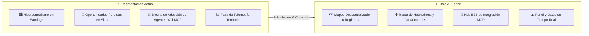

<div align="center">

# 🇨🇱 Chile AI Radar & Map
### *Ecosistema Territorial de Inteligencia Artificial & Orquestación WebMCP*

[](https://radar.browns.studio)
[](https://lucid-goodall.vercel.app)
[](https://radar.browns.studio/admin)

<br/>


<br/>

[](https://react.dev/)
[](https://vitejs.dev/)
[](https://www.typescriptlang.org/)
[](https://tailwindcss.com/)
[](https://firebase.google.com/)
[](https://unstoppabledomains.com/)

</div>

---

## 🎯 El Problema que Resolvemos

A pesar de que Chile se posiciona como el **#1 de Latinoamérica en el Índice Latinoamericano de Inteligencia Artificial (ILIA)**, el ecosistema real enfrenta cuatro fallas estructurales críticas:



### 1. Hipercentralismo y Ceguera Territorial
Más del **80% de la visibilidad, financiamiento y eventos** de IA se concentran exclusivamente en Santiago. Los desarrollos en minería autónoma en Antofagasta, agricultura de precisión en O'Higgins, IA marina en Los Lagos o centros de datos verdes en Magallanes operan de forma aislada y sin vitrina nacional.

### 2. Oportunidades y Convocatorias Dispersas en Silos
Hackathons, fondos concursables, datathons y cumbres de IA se anuncian fragmentados en grupos de WhatsApp, posts efímeros de LinkedIn o sitios web universitarios aislados. **El talento y las startups se enteran tarde**, perdiendo plazos de postulación y capital semilla.

### 3. La Brecha de Adopción Empresarial y Agentes (WebMCP)
Las empresas y PyMEs tradicionales tienen la urgencia de adoptar Inteligencia Artificial, pero existe una brecha técnica: no saben qué proveedores locales existen, qué estándares de interoperabilidad usar (*Model Context Protocol - MCP*) ni cómo transicionar de simples chatbots a **agentes autónomos conectados a sus sistemas de negocio**.

### 4. Ausencia de un Registro Abierto y Confiable
No existía un punto de encuentro georreferenciado, verificado por administradores y accesible en tiempo real que permita a inversionistas, talento y gobierno mapear la oferta real de capacidades de IA en Chile.

---

## 💡 La Solución: Chile AI Radar


**Chile AI Radar** es la plataforma abierta que transforma este escenario fragmentado en un **ecosistema articulado e interactivo**:

1. **Mapeo Territorial Integral**: Cada una de las 16 regiones cuenta con su perfil de capacidades, startups activas, centros de investigación y casos de uso.
2. **Radar de Convocatorias en Tiempo Real**: Sistema de alertas con días restantes para el cierre de postulaciones, premios y modalidad virtual/presencial.
3. **WebMCP Business Hub**: Puente directo para que empresas postulen sus requerimientos de automatización y se conecten con arquitecturas de agentes IA.
4. **Lista de Espera y Boletín Nacional**: Conexión directa a base de datos en Firestore para mantener informada a la comunidad con reportes periódicos y llamados de innovación.
5. **Gobernanza y Moderación Administrativa (`/admin`)**: Panel protegido mediante Firebase Auth (Google OAuth) para validar registros, moderar postulaciones B2B y exportar métricas en `.csv`.

---

## 🏗️ Arquitectura Técnica

```text
┌─────────────────────────────────────────────────────────────────────────┐
│                           CAPA DE CLIENTE (SPA)                         │
│   React 19 • Vite 8 • Tailwind CSS v4 • Lucide Icons • Motion           │
└────────────────────────────────────┬────────────────────────────────────┘
                                     │
                 ┌───────────────────┴───────────────────┐
                 ▼                                       ▼
┌───────────────────────────────────┐ ┌───────────────────────────────────┐
│     ENRUTAMIENTO & EDGE (Vercel)  │ │      BASE DE DATOS (Firestore)    │
│  - radar.browns.studio            │ │  - Collection: waitlist_subs     │
│  - vercel.json (SPA Rewrites)     │ │  - Collection: business_subs     │
│  - Edge Global CDN / SSL          │ │  - Collection: organizations     │
└───────────────────────────────────┘ │  - Collection: events            │
                                      └─────────────────┬─────────────────┘
                                                        │
                                                        ▼
                                      ┌───────────────────────────────────┐
                                      │      AUTENTICACIÓN & SEGURIDAD    │
                                      │  - Firebase Auth (Google OAuth)   │
                                      │  - firestore.rules (Admin Guard)  │
                                      └───────────────────────────────────┘
```

---

## 🧩 Módulos Principales

| Módulo | Ruta / Tab | Qué Resuelve |
| :--- | :--- | :--- |
| **🗺️ Mapa Regional** | `/` (`#mapa`) | Visibiliza el ecosistema de las 16 regiones, startups, centros I+D y universidades fuera de Santiago. |
| **📅 Agenda & Radar** | `/eventos` | Agrupa convocatorias, hackathons y meetups con estado de urgencia y cuenta regresiva. |
| **🤖 Empresas & WebMCP**| `/webmcp` | Formulario de diagnóstico e incorporación de agentes y protocolos MCP para empresas chilenas. |
| **🛡️ Panel de Control** | `/admin` | Gestión y moderación en vivo de suscriptores y postulaciones B2B para el administrador autorizado. |

---

## 🚀 Puesta en Marcha Local

### Prerrequisitos
- **Node.js**: v20+ o superior
- **Gestor de Paquetes**: `npm` o `bun`
- **Git**

```bash
# 1. Clonar el repositorio
git clone https://github.com/CaBsCrypto/radar.git
cd radar

# 2. Instalar dependencias con compatibilidad de pares
npm install --legacy-peer-deps

# 3. Configurar entorno
cp .env.example .env

# 4. Iniciar servidor local
npm run dev
```
La aplicación abrirá en `http://localhost:3000`.

---

## 🔐 Configuración de Firebase & Reglas

La conexión a Cloud Firestore y Firebase Auth está centralizada en `firebase-applet-config.json`.

Las reglas de seguridad en [firestore.rules](firestore.rules) aseguran:
- **`waitlist_subscribers`**: Inserción pública abierta para que los usuarios se registren en la whitelist. Lectura y descarga restringida al admin (`cabscryptocontacto@gmail.com`).
- **`business_submissions`**: Postulaciones B2B abiertas para empresas. Gestión y moderación exclusiva para el administrador.
- **`organizations` & `events`**: Lectura abierta para todos los visitantes; edición y borrado protegido.

---

## 🌐 Despliegue en Producción & Dominio

### Despliegue en Vercel
```bash
# Desplegar build a producción
vercel --prod
```

### Configuración en Unstoppable Domains / DNS Registrar
Para que `radar.browns.studio` apunte a la aplicación en Vercel:

| Tipo de Registro | Host / Subdominio | Valor / Destino | TTL |
| :--- | :--- | :--- | :--- |
| **CNAME** | `radar` | `cname.vercel-dns.com` | Automático |
| *(Alternativa) **A*** | `radar` | `76.76.21.21` | Automático |

---

## 👥 Comunidad y Contacto

- **Organización / Autor:** CaBsCrypto
- **Dominio Principal:** [https://browns.studio](https://browns.studio)
- **Email:** `cabscryptocontacto@gmail.com`
- **Repositorio:** [github.com/CaBsCrypto/radar](https://github.com/CaBsCrypto/radar)

---

<div align="center">
  <sub>Impulsando la descentralización del talento y la tecnología de Inteligencia Artificial en Chile 🇨🇱</sub>
</div>
