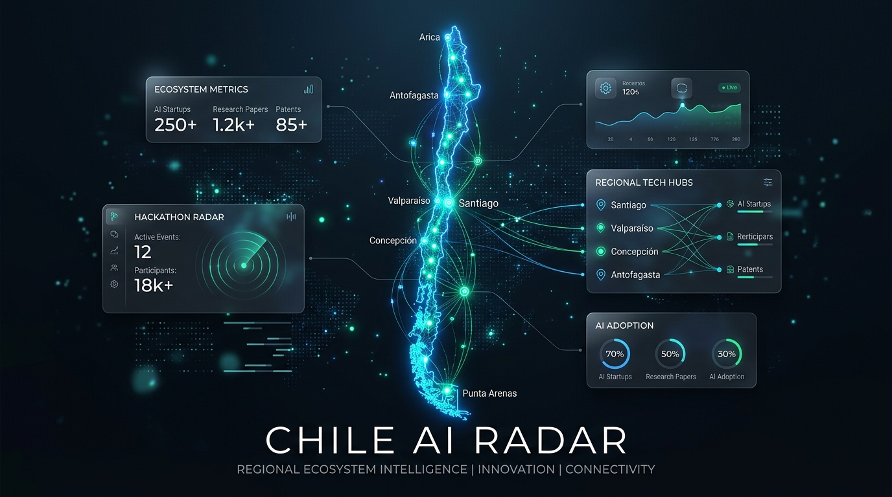
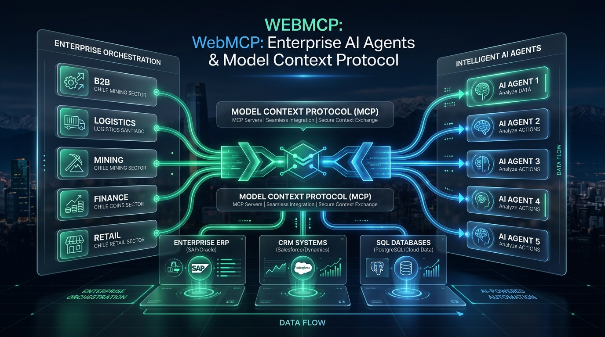
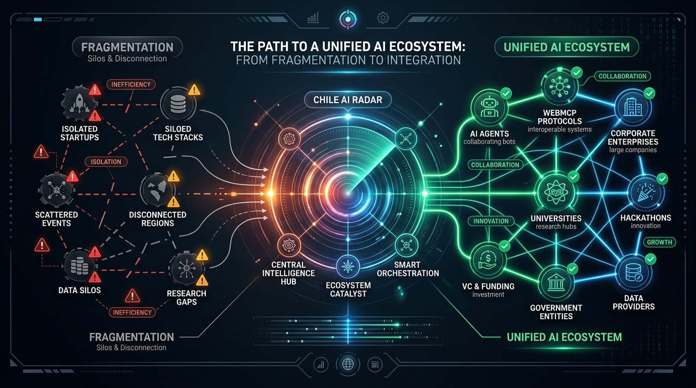
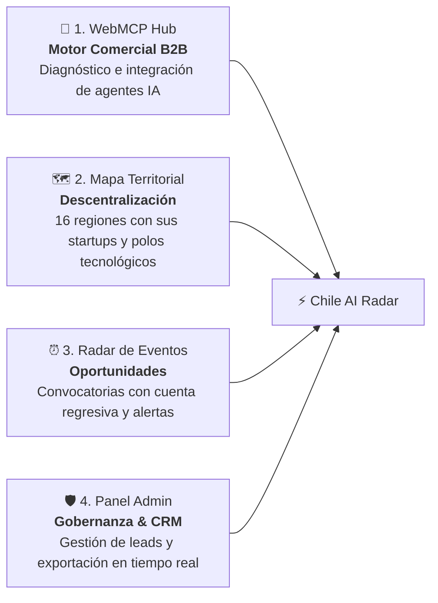

<div align="center">

# 🇨🇱 Chile AI Radar & Map
### *Ecosistema Territorial de IA & Hub de Negocios WebMCP*

[](https://radar.browns.studio)
[](https://radar.browns.studio/webmcp)
[](./ESTUDIANTES.md)
[](./AGENTS.md)

<br/>



</div>

---

## 📌 1. Inicio: ¿Qué es Chile AI Radar?

**Chile AI Radar** es la plataforma interactiva que centraliza, georreferencia y articula todo el ecosistema de Inteligencia Artificial en Chile a lo largo de sus **16 regiones**, con un foco estratégico en la **adopción empresarial de Agentes Autónomos mediante el estándar WebMCP**.

El proyecto conecta a tres actores fundamentales del mercado:
1. **Empresas & PyMEs B2B**: Organizaciones que buscan automatizar flujos reales conectando IA a sus sistemas internos (ERPs, CRMs, SQL).
2. **Startups y Desarrolladores de IA**: Creadores de soluciones e implementadores de arquitecturas de agentes.
3. **Inversionistas y Entidades Públicas**: Fondos de capital y hubs tecnológicos que requieren telemetría real del avance en IA en cada región.

---

## 🚀 2. WebMCP: Nuestra Mayor Oportunidad de Negocio

<div align="center">



</div>

> [!IMPORTANT]
> **El gran cambio de paradigma**: Las empresas ya no buscan simples chatbots de texto. La verdadera demanda corporativa está en **Agentes de IA Autónomos** capaces de ejecutar acciones, consultar bases de datos y orquestar flujos de trabajo en producción.

### ¿Por qué WebMCP es el motor comercial de la plataforma?

1. **Adopción del Estándar Global (MCP - Model Context Protocol)**:
   - MCP es el protocolo abierto estándar de la industria que permite a los modelos de IA conectarse de forma segura con herramientas, APIs, archivos y sistemas corporativos (SAP, Salesforce, PostgreSQL, Notion, etc.).
2. **Generación Continua de Leads B2B Calificados**:
   - A través de la sección y formulario en [`/webmcp`](https://radar.browns.studio/webmcp), directores de tecnología y gerentes de innovación postulan sus empresas solicitando diagnósticos de integración de agentes.
   - Cada postulación captura datos clave: **nombre de empresa, contacto directo, teléfono/WhatsApp, estado técnico actual y objetivo del agente**.
3. **Modelo de Negocio & Monetización**:
   - 💼 **Consultoría & Diagnóstico**: Evaluación técnica del stack actual, viabilidad y madurez de procesos para la adopción de agentes de IA.
   - 🛠️ **Construcción, Creación e Implementación de WebMCP a Medida**: Diseño, arquitectura e integración end-to-end de servidores MCP y agentes autónomos conectados a bases de datos, ERPs (SAP/Oracle) y CRMs (Salesforce/HubSpot).
   - 🤝 **Marketplace & Matchmaking B2B**: Articulación entre corporaciones con demanda de automatización y proveedores o desarrolladores certificados de IA.
   - 🏢 **Planes Corporativos & Visibilidad Enfocada**: Posicionamiento preferencial, verificación oficial en el mapa territorial y vitrina de casos de éxito en el radar nacional.
4. **Pipeline Comercial Integrado en el Panel Admin (`/admin`)**:
   - El equipo de ventas puede gestionar el ciclo de vida de cada lead en tiempo real: `Pendiente` $\rightarrow$ `Contactado` $\rightarrow$ `Verificado`, con acceso a enlaces directos de WhatsApp, correo y exportación a `.csv`.

---

## ⚠️ 3. El Problema que Resolvemos

A pesar de que Chile lidera los rankings de IA en Latinoamérica (ILIA), el ecosistema opera con cuatro fallas críticas:

| Dolor Crítico | Descripción del Problema |
| :--- | :--- |
| **1. Brecha de Implementación B2B** | Las empresas quieren usar IA pero están estancadas en pruebas de concepto sin saber cómo conectar agentes seguros a sus bases de datos y ERPs. |
| **2. Hipercentralismo Territorial** | Más del 80% de la visibilidad y eventos se concentran en Santiago, invisibilizando el potencial minero del norte, agro del centro y acuícola del sur. |
| **3. Convocatorias y Fondos Dispersos** | Hackathons, datathons y fondos concursables se publican en canales aislados, provocando que el talento se entere tarde. |
| **4. Sin Registro Verificado** | No existía un directorio abierto y en tiempo real para validar qué empresas y startups realmente están construyendo IA en Chile. |

---

## 💡 4. La Solución: ¿Cómo lo Abordamos?



Abordamos estos dolores mediante **4 pilares integrados**:



### 🤖 Pilar 1: Empresas & WebMCP Hub (`/webmcp`)
- Formulario de postulación directa para empresas que buscan adoptar agentes.
- Catálogo de casos de uso reales por industria: minería, logística, finanzas, retail y salud.

### 🗺️ Pilar 2: Mapa Territorial Interactivo (`/` o `#mapa`)
- Visualización de las 16 regiones de Chile con filtros sectoriales.
- Fichas de organizaciones, startups, scaleups, centros I+D y universidades locales.

### ⏰ Pilar 3: Radar de Convocatorias & Hackathons (`/eventos`)
- Calendario nacional de eventos de IA con cuenta regresiva para el cierre de inscripciones.
- Campana interactiva de notificaciones con conteo de convocatorias urgentes.

### 🛡️ Pilar 4: Panel Administrativo y Captura en Tiempo Real (`/admin`)
- Control de acceso restringido con Google OAuth (`cabscryptocontacto@gmail.com`).
- Tabla de **Postulaciones Empresariales WebMCP** con cambio de estado en vivo.
- Tabla de **Suscriptores de la Waitlist** con intereses y región preferida.
- Descarga instantánea de bases de datos en formato `.csv`.

---

## 🧭 5. Guía Rápida para el Equipo (Onboarding)

### 📚 Documentos de Referencia Obligatoria:
- 🎓 **[ESTUDIANTES.md](./ESTUDIANTES.md)**: Guía metodológica para desarrolladores y estudiantes (cómo pensar en voz alta, debatir con la IA, las 4 fases de desarrollo y promptbook listo).
- 🤖 **[AGENTS.md](./AGENTS.md)**: Protocolo técnico y directivas de sistema que los Agentes de IA deben seguir obligatoriamente en este repositorio.

### ¿Cómo probar la plataforma en 3 pasos?
1. **Explorar el Hub WebMCP**: Entra a [radar.browns.studio/webmcp](https://radar.browns.studio/webmcp) y prueba el formulario de postulación empresarial.
2. **Explorar el Mapa y Eventos**: Navega por [radar.browns.studio](https://radar.browns.studio) para filtrar por región y revisar hackathons activas.
3. **Gestionar Leads en el Panel Admin**: Ingresa a [radar.browns.studio/admin](https://radar.browns.studio/admin) con la cuenta autorizada para revisar y exportar las postulaciones.

### Flujo de Datos y Conversión Comercial
```text
[Empresa visita /webmcp] ──> [Envía Postulación B2B] ──> [Cloud Firestore] ──> [Panel /admin (Contacto y Cierre)]
```

---

## 💻 6. Stack Tecnológico

| Capa | Herramienta | Propósito |
| :--- | :--- | :--- |
| **Frontend** | React 19 + Vite 8 | Interfaz reactiva ultrarrápida y componentes modulares |
| **Estilos & UI** | Tailwind CSS v4 + Lucide Icons | Diseño responsive moderno y consistente |
| **Base de Datos** | Google Cloud Firestore | Base NoSQL serverless en tiempo real con reglas de seguridad |
| **Autenticación** | Firebase Auth (Google OAuth) | Seguridad de acceso al panel administrativo |
| **Hosting & Edge** | Vercel | Despliegue global en Edge Network con rewrites SPA (`vercel.json`) |
| **Dominio** | Unstoppable Domains | Resolución Web3 y DNS para `radar.browns.studio` |

---

## 🛠️ 7. Comandos del Proyecto (Cheat Sheet)

```bash
# 1. Instalar dependencias
npm install --legacy-peer-deps

# 2. Iniciar entorno de desarrollo local (puerto 3000)
npm run dev

# 3. Compilar para producción (validación estricta de TypeScript)
npm run build

# 4. Desplegar a Vercel
vercel --prod
```

---

## 🌐 8. Infraestructura & Dominios

- **Dominio Principal**: `https://radar.browns.studio`
- **Subdominio WebMCP**: `https://radar.browns.studio/webmcp`
- **Panel Admin**: `https://radar.browns.studio/admin`
- **Configuración DNS (Unstoppable Domains)**:
  - **Tipo**: `CNAME`
  - **Host**: `radar`
  - **Valor**: `cname.vercel-dns.com`

---

## 👥 Equipo y Contacto

- **Proyecto:** Chile AI Radar & WebMCP Hub
- **Organización:** CaBsCrypto
- **Web:** [browns.studio](https://browns.studio)
- **Contacto Comercial & Alianzas:** `cabscryptocontacto@gmail.com`
- **Repositorio Oficial:** [github.com/CaBsCrypto/radar](https://github.com/CaBsCrypto/radar)

---

<div align="center">
  <sub>Liderando la adopción de agentes de Inteligencia Artificial y protocolos WebMCP en Chile y Latinoamérica 🇨🇱 🚀</sub>
</div>
