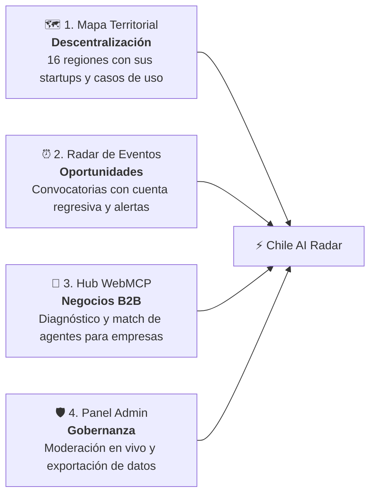

<div align="center">

# 🇨🇱 Chile AI Radar & Map
### *Guía General del Proyecto y Ecosistema Nacional de IA*

[](https://radar.browns.studio)
[](https://lucid-goodall.vercel.app)
[](https://radar.browns.studio/admin)

<br/>


</div>

---

## 📌 1. Inicio: ¿Qué es Chile AI Radar?

**Chile AI Radar** es la plataforma interactiva que centraliza, georreferencia y conecta todo el ecosistema de Inteligencia Artificial en Chile a lo largo de sus **16 regiones**.

El proyecto nace para articular a tres actores clave en un solo lugar:
1. **El Talento y las Startups**: Creadores, investigadores y comunidades tecnológicas.
2. **Las Empresas y PyMEs**: Organizaciones que buscan adoptar agentes de IA y estándares como **Model Context Protocol (WebMCP)**.
3. **Inversionistas y Ecosistema**: Fondos de capital, universidades y entidades públicas que buscan visibilidad real de las capacidades tecnológicas del país.

---

## ⚠️ 2. El Problema

A pesar de que Chile lidera los índices de IA en Latinoamérica (ILIA), el ecosistema opera con cuatro fallas críticas:

| Dolor Crítico | Descripción del Problema |
| :--- | :--- |
| **1. Hipercentralismo** | Más del 80% de la atención, eventos e inversión se concentran en Santiago. El desarrollo en las otras 15 regiones queda invisible. |
| **2. Convocatorias Dispersas** | Hackathons, fondos concursables y meetups se publican en grupos cerrados de WhatsApp o posts efímeros de LinkedIn. La gente se entera tarde. |
| **3. Brecha de Adopción (WebMCP)** | Las empresas quieren implementar IA, pero no saben con qué proveedores locales trabajar ni cómo conectar agentes autónomos a sus sistemas. |
| **4. Sin Registro Confiable** | No existía un mapa público, actualizado en tiempo real y moderado donde consultar qué se está construyendo en cada región. |

---

## 💡 3. La Solución: ¿Cómo lo Abordamos?


Abordamos estos dolores mediante **4 pilares integrados**:



### 🗺️ Pilar 1: Mapa Territorial Interactivo
- Permite recorrer visualmente las 16 regiones de Chile.
- Muestra startups, scaleups, centros I+D y universidades en cada territorio.
- Descentraliza el foco permitiendo filtrar por sectores (minería, agro, salud, fintech, etc.).

### ⏰ Pilar 2: Radar de Convocatorias & Hackathons
- Calendario unificado de eventos de IA (virtuales y presenciales).
- Contador regresivo con días restantes para el cierre de postulaciones y premios.
- Sistema de campana de notificaciones para no perder fechas clave.

### 🤖 Pilar 3: Empresas & WebMCP Hub
- Formulario de diagnóstico para que empresas soliciten asesoría en integración de agentes.
- Catálogo de casos de uso y herramientas tecnológicas implementadas en producción.

### 🛡️ Pilar 4: Panel Administrativo y Captura en Tiempo Real (`/admin`)
- Captura de suscriptores al boletín nacional de IA.
- Gestión en vivo de postulaciones empresariales (*Pendiente*, *Contactado*, *Verificado*).
- Autenticación protegida con Google OAuth (`cabscryptocontacto@gmail.com`) y exportación a `.csv`.

---

## 🧭 4. Guía Rápida para el Equipo

### ¿Cómo probar la plataforma en 3 pasos?
1. **Ver la Web Principal**: Entra a [radar.browns.studio](https://radar.browns.studio) y navega por el mapa interactivo o la pestaña de **Eventos**.
2. **Probar el Registro de Waitlist**: En el pie de página o en los modales, suscribe un correo de prueba; se guardará de inmediato en Firebase Firestore.
3. **Revisar el Panel Admin**: Entra a [radar.browns.studio/admin](https://radar.browns.studio/admin) e inicia sesión con la cuenta de Google autorizada para ver los registros y exportar datos.

### Flujo de Datos
```text
[Usuario en la Web] ──> [Formulario Waitlist / WebMCP] ──> [Cloud Firestore] ──> [Panel /admin (Google Auth)]
```

---

## 💻 5. Stack Tecnológico

| Capa | Herramienta | ¿Para qué se usa? |
| :--- | :--- | :--- |
| **Frontend** | React 19 + Vite 8 | Interfaz rápida, modular y reactiva |
| **Diseño & UI** | Tailwind CSS v4 + Lucide Icons | Estilos modernos, responsivos y modo claro uniforme |
| **Base de Datos** | Google Cloud Firestore | Base de datos NoSQL serverless en tiempo real |
| **Autenticación** | Firebase Auth (Google OAuth) | Acceso exclusivo al panel de administración |
| **Hosting & Edge** | Vercel | Despliegue global, CDN y manejo de rutas SPA |
| **Dominio Web3** | Unstoppable Domains | DNS y resolución para `radar.browns.studio` |

---

## 🛠️ 6. Comandos del Proyecto (Cheat Sheet)

```bash
# 1. Instalar dependencias (obligatorio usar legacy-peer-deps por Vite 8)
npm install --legacy-peer-deps

# 2. Iniciar servidor local de desarrollo
npm run dev

# 3. Compilar para producción (validación de TypeScript + bundle)
npm run build

# 4. Desplegar cambios directamente a Vercel
vercel --prod
```

---

## 🌐 7. Infraestructura & Dominios

- **Dominio Principal**: `https://radar.browns.studio`
- **Mirror Alternativo**: `https://lucid-goodall.vercel.app`
- **Configuración DNS en Unstoppable Domains**:
  - **Tipo**: `CNAME`
  - **Host**: `radar`
  - **Valor**: `cname.vercel-dns.com`

---

## 👥 Equipo y Contacto

- **Proyecto:** Chile AI Radar
- **Organización:** CaBsCrypto
- **Web:** [browns.studio](https://browns.studio)
- **Contacto:** `cabscryptocontacto@gmail.com`
- **Repositorio:** [github.com/CaBsCrypto/radar](https://github.com/CaBsCrypto/radar)

---

<div align="center">
  <sub>Construido para que todo el equipo cuente con una visión clara, compartida y ejecutable 🇨🇱 🚀</sub>
</div>
